<p align="center">
  
</p>

<h1 align="center">ioBroker Objects</h1>

<p align="center">
  Eine iOS-, iPadOS- und Apple-Watch-App zum Durchsuchen, Beobachten und Bearbeiten von ioBroker-Objekten und States.
  Direkt im lokalen Netzwerk, ueber VPN oder ueber Cloudflare Zero Trust.
</p>

<p align="center">
  <a href="https://apps.apple.com/us/app/iobroker-objects/id6778004193">
    
  </a>
</p>

<p align="center">
  <a href="#funktionen">Funktionen</a> ·
  <a href="#screenshots">Screenshots</a> ·
  <a href="#dashboard">Dashboard</a> ·
  <a href="#apple-watch">Apple Watch</a> ·
  <a href="#cloudflare-zero-trust">Cloudflare</a>
</p>

## Screenshots

### iPhone

<p align="center">
  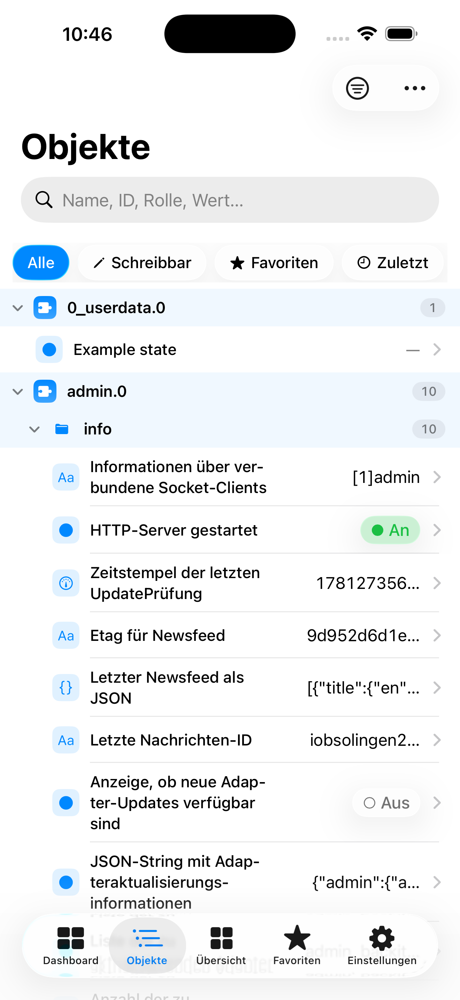
  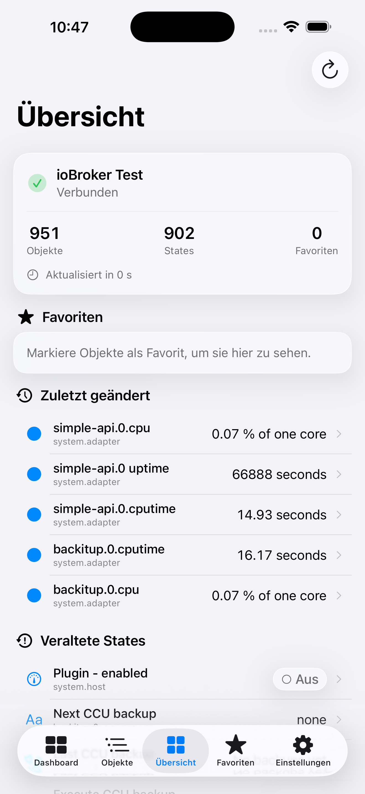
  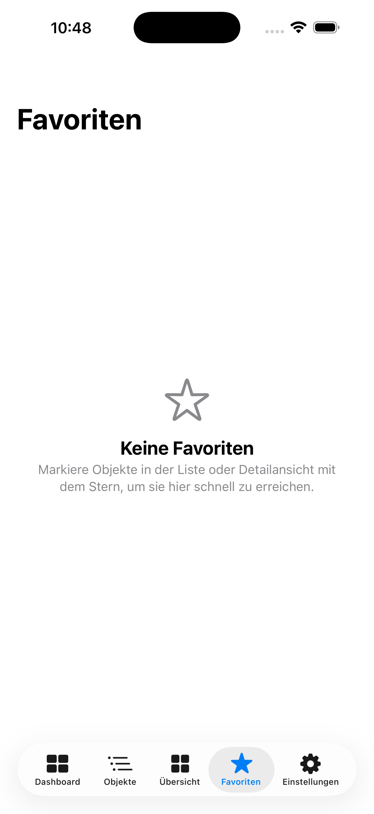
  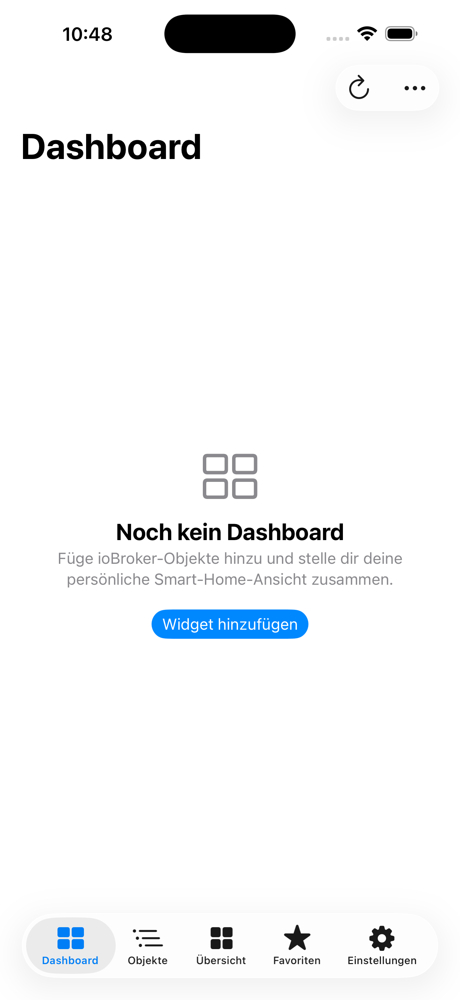
  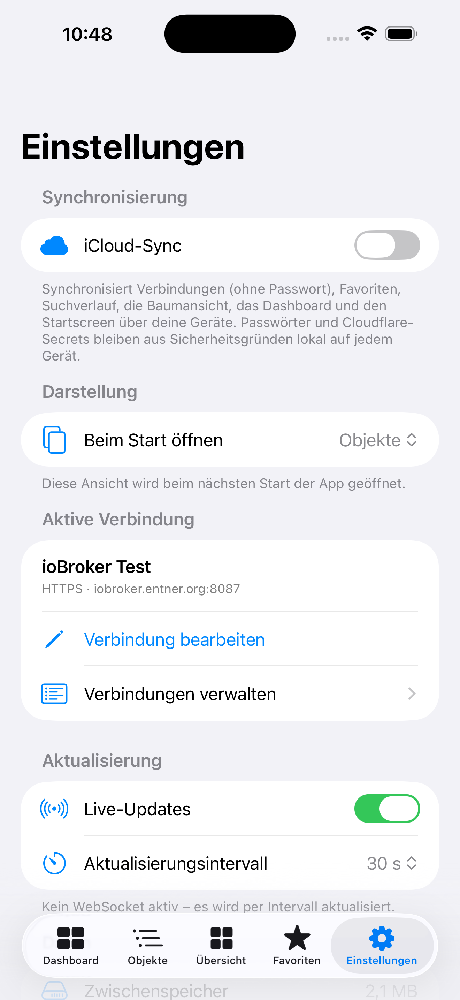
</p>

### iPad

<p align="center">
  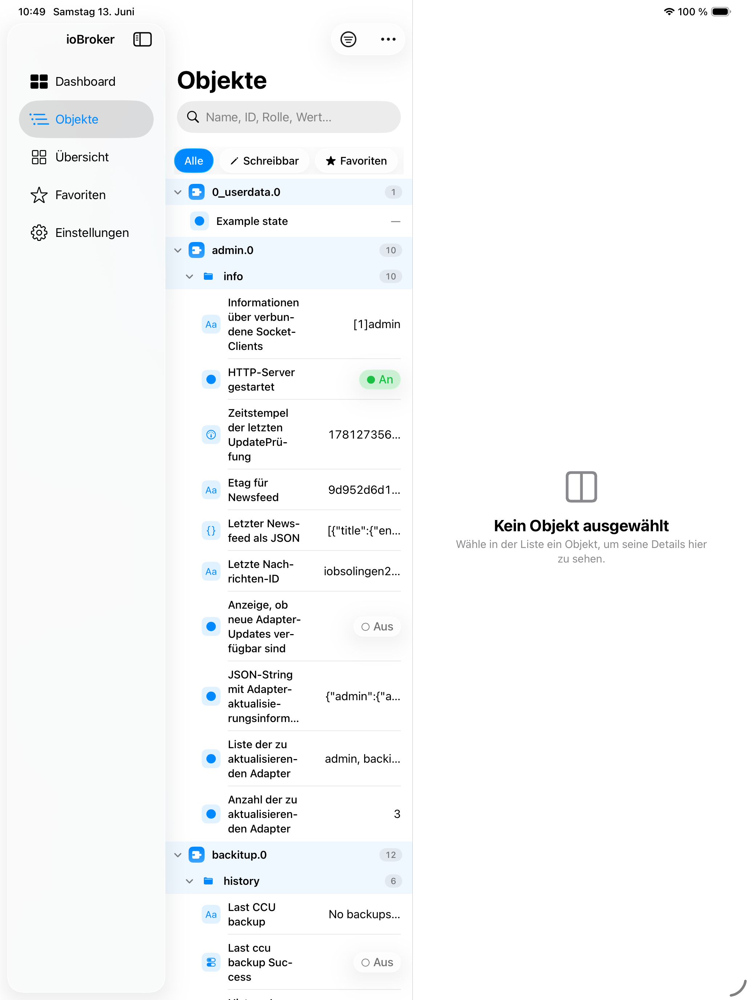
  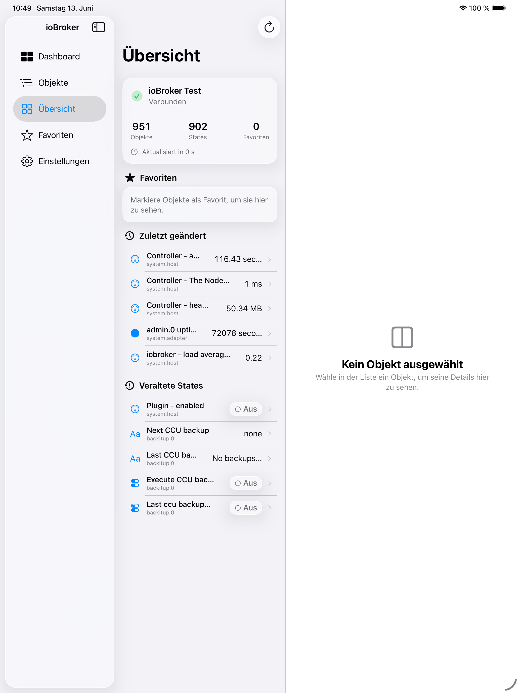
  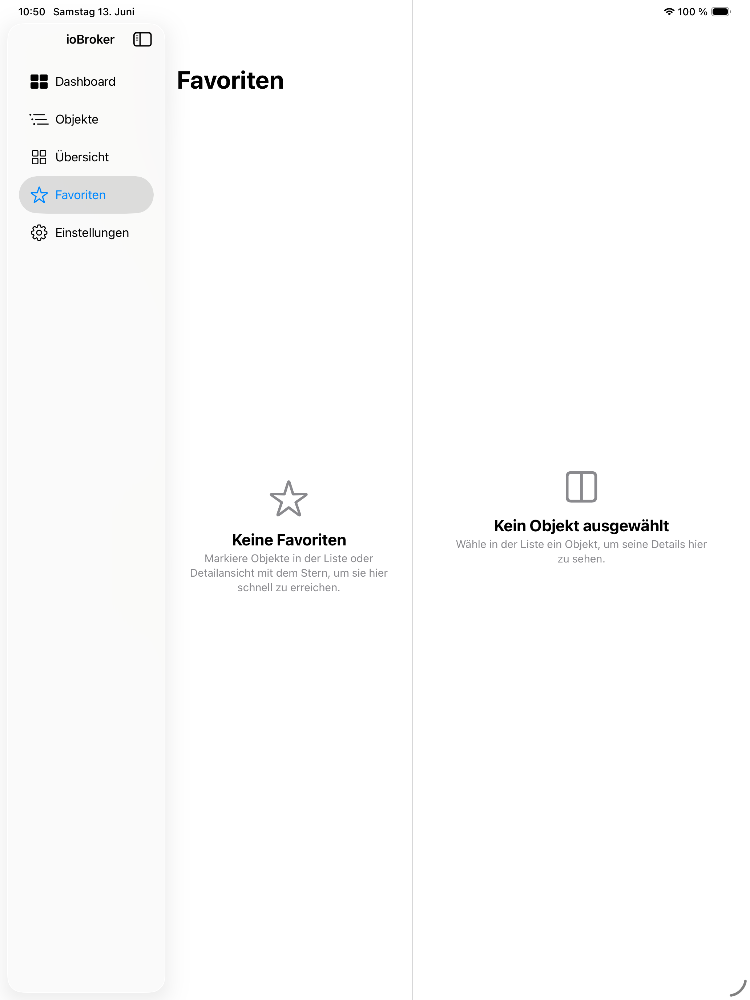
  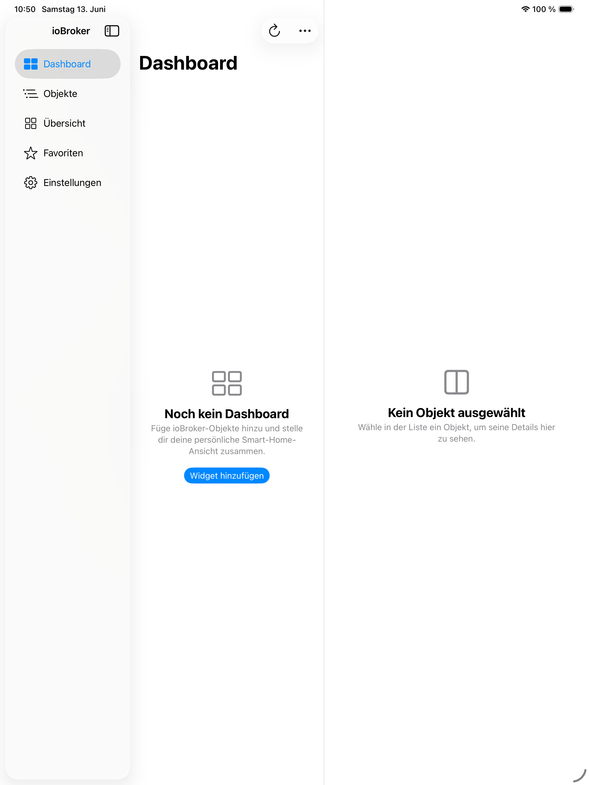
  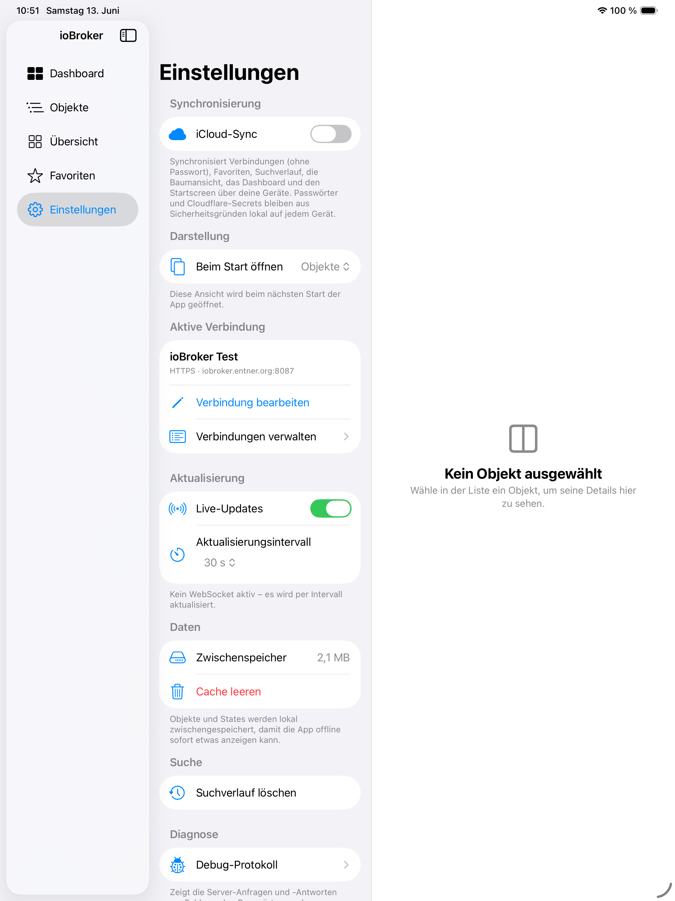
</p>

### Apple Watch

<p align="center">
  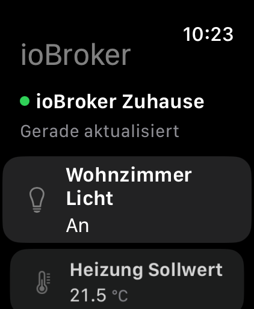
  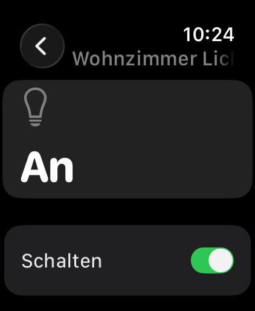
  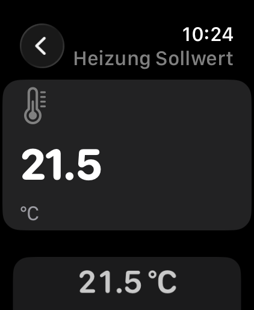
</p>

## Funktionen

- Verbindungen zu mehreren ioBroker-Instanzen speichern
- Zugriff ueber `simple-api` oder `rest-api`
- Automatische API-Erkennung, wenn der API-Typ auf "Automatisch" steht
- HTTP und HTTPS
- Optionales Zulassen selbstsignierter TLS-Zertifikate fuer lokale Installationen
- Sichere Speicherung von Passwoertern im iOS-Schluesselbund
- Cloudflare Zero Trust Access Service Token pro Verbindung
- Durchsuchen aller ioBroker-State-Objekte
- Baumansicht nach Adapter und Objektstruktur
- Filter fuer Adapter, Rollen, schreibbare Objekte und Favoriten
- Detailansicht mit Objekt-Metadaten, State-Wert, Zeitstempeln und Rohdaten
- Schreiben von States, wenn das Objekt als schreibbar markiert ist
- Frei konfigurierbares Dashboard als persoenliche Smart-Home-Ansicht (siehe unten)
- Auswaehlbarer Startscreen (Dashboard, Objekte, Uebersicht oder Favoriten)
- Favoriten
- Suchverlauf
- Objekt- und State-Cache fuer schnelle Rueckkehr in die App
- Live-Updates ueber socket.io, wenn der ioBroker web/admin-Adapter erreichbar ist
- Polling-Fallback, wenn Live-Updates nicht verfuegbar sind
- Optionale iCloud-Synchronisierung der Einrichtung (inkl. Dashboard und Startscreen) ueber deine Geraete
- Debug-Protokoll fuer Verbindung, REST-Anfragen und Live-Updates
- Demo-Verbindung mit Beispieldaten
- Onboarding mit Sicherheitshinweisen

## Voraussetzungen

Auf ioBroker-Seite brauchst du je nach Zugriff:

- `simple-api` Adapter, typischer Port `8087`
- oder `rest-api` Adapter, typischer Port `8093`
- fuer Live-Updates zusaetzlich den `web` oder `admin` Adapter mit socket.io, oft Port `8082`

Die App greift nicht direkt auf die ioBroker-Datenbank zu. Sie verwendet HTTP/HTTPS fuer REST-Anfragen und optional WebSocket fuer Live-Updates.

## Verbindung einrichten

In der App legst du eine Verbindung mit diesen Feldern an:

- Name: frei waehlbarer Anzeigename
- Host: IP, lokaler Hostname oder Cloudflare-Subdomain
- Protokoll: HTTP oder HTTPS
- Port: lokaler API-Port, z. B. `8087` fuer simple-api oder `8093` fuer rest-api
- API: Automatisch, simple-api oder rest-api
- Benutzername und Passwort: optional, je nach ioBroker-Konfiguration
- Live-Updates verwenden: aktiviert den socket.io-Versuch
- WebSocket-Port: optionaler lokaler socket.io-Port, z. B. `8082`

Bei einer lokalen Verbindung kann die App unterschiedliche Ports direkt ansprechen:

```text
REST:      http://192.168.1.10:8087
WebSocket: ws://192.168.1.10:8082/socket.io/
```

Bei Cloudflare ist das anders: oeffentlich wird normalerweise kein Port in der URL verwendet. Cloudflare routet intern auf die passenden lokalen Ports.

## Live-Updates

ioBroker liefert Live-Updates ueber socket.io. Das kommt normalerweise nicht vom `simple-api` Adapter, sondern vom `web` oder `admin` Adapter.

Lokales Beispiel:

```text
simple-api: http://192.168.1.10:8087
socket.io:  ws://192.168.1.10:8082/socket.io/
```

Wenn du lokal `simple-api` verwendest und keinen WebSocket-Port eintraegst, verwendet die App Polling. Wenn du einen WebSocket-Port eintraegst, versucht sie Live-Updates.

Wenn der WebSocket nicht erreichbar ist, faellt die App automatisch auf Polling zurueck. Im Debug-Protokoll erscheinen dann `LIVE` Eintraege zum WebSocket-Versuch.

## Dashboard

Der Tab **Dashboard** ist eine vollstaendig vom Nutzer konfigurierbare Smart-Home-Ansicht. Im Unterschied zur **Uebersicht**, die automatisch aus Verbindungsstatus, Favoriten und zuletzt geaenderten States erzeugt wird, stellst du das Dashboard selbst aus ioBroker-Objekten zusammen und bedienst sie direkt.

- **Hinzufuegen:** Im Bearbeitungsmodus oder ueber den Empty-State waehlst du zwischen einer **Smart-Home-Komponente** (kombiniert mehrere zusammengehoerige States in einer Card) und einem **einzelnen ioBroker-Objekt**. Fuer die Objektauswahl wird derselbe Baum wie im Tab *Objekte* genutzt (Suche, Filter, Gruppierung).

### Generische Einzelobjekt-Widgets

Ein generisches Widget zeigt genau einen State:

- *Automatisch* – waehlt anhand des Objekts den passenden Typ
- *Wertanzeige* – zeigt den aktuellen Wert mit Einheit
- *Schalter* – fuer schreibbare Boolean-Objekte
- *Regler* – fuer schreibbare Zahlen mit gueltigem Bereich (`min`/`max`)

### Smart-Home-Komponenten

Eine Komponenten-Card kombiniert mehrere ioBroker-States zu einer echten Smart-Home-Bedienung. Beim Hinzufuegen waehlst du einen Komponententyp (oder **Automatisch erkennen**) und ein primaeres Objekt; die App schlaegt anhand der ioBroker-Rolle, des Datentyps/Wertebereichs, von Begriffen in ID/Name und benachbarter States im selben Channel passende Zuordnungen vor. **Automatisch erkannte Zuordnungen sind nur Vorschlaege** – du kannst sie in der Konfiguration unter *Zugeordnete States* pruefen, manuell aendern oder optionale entfernen, mit einer Live-Vorschau der fertigen Card.

- **Licht:** Ein/Aus und Helligkeit (immer als Prozent angezeigt, beim Schreiben in den nativen Bereich des Adapters umgerechnet – egal ob 0–100, 0–1 oder 0–255), optional Farbtemperatur. Die Card funktioniert auch mit nur einem Power- *oder* nur einem Dimm-State.
- **Rollladen/Jalousie:** Auf-/Stop-/Ab-Tasten und Positionsanzeige/-regler. Da Adapter unterschiedlich definieren, ob 0 % „offen" oder „geschlossen" bedeutet, gibt es die Option **Position invertieren** (keine automatische Invertierung).
- **Thermostat:** grosse Ist-Temperatur, direkt einstellbare Zieltemperatur (mit nativer Schrittweite), optional Luftfeuchtigkeit und Betriebsmodus (wenn `common.states` vorhanden).
- **Klima-Sensor:** Temperatur und Luftfeuchtigkeit (lesend).
- **Fenster/Tuer-Kontakt** und **Bewegungsmelder:** klarer Zustand mit Symbol, letzter Aenderung und optionalem Batteriestatus.
- **Energie:** aktuelle Leistung und Gesamtenergie mit den Einheiten aus `common.unit`.
- **Szene/Aktion:** eine eindeutige Aktionsschaltflaeche (kein dauerhafter Ein-/Aus-Schalter).

Schreibvorgaenge laufen ausschliesslich ueber `AppViewModel.setValue` mit der bestehenden Sicherheitsbestaetigung; Slider schreiben erst beim Loslassen, und waehrend eines Schreibvorgangs sind weitere Aenderungen gesperrt. Fehlt ein optionaler State, bleibt die Card funktionsfaehig (z. B. Licht ohne Dimmer = einfacher Schalter); fehlt das primaere Objekt, erscheint die Platzhalterkarte mit *Neu zuordnen* / *Entfernen*.

- **Widgetgroessen:** Kompakt, Standard, Breit, Gross. Das Layout wird responsiv berechnet (keine festen Pixelkoordinaten) und passt sich iPhone, iPad, Split View, Stage Manager und Dynamic Type an.
- **Bearbeitungsmodus:** Widgets per Drag-and-drop oder ueber das Menue (auch per VoiceOver-Aktionen) neu anordnen, Groesse aendern, konfigurieren oder entfernen. Im Bearbeitungsmodus sind die Bedienelemente deaktiviert, damit nichts versehentlich geschaltet wird.
- **Sicherheitskritische States** (z. B. Schloesser, Tueren, Alarm, Heizung) fragen wie in der Detailansicht vor dem Schreiben nach.
- **Live-Updates:** Die Werte aller Dashboard-Cards aktualisieren sich ueber die bestehende WebSocket-/Polling-Logik – bei Komponenten werden **alle** beteiligten States abonniert (z. B. Power *und* Helligkeit einer Licht-Card). Es werden keine zusaetzlichen Timer pro Card gestartet.
- **Offline/Cache:** Bei fehlender Verbindung zeigt das Dashboard zwischengespeicherte Werte, kennzeichnet sie als moeglicherweise veraltet und deaktiviert schreibende Bedienelemente.
- **Fehlende Objekte:** Verweist ein Widget auf eine nicht mehr vorhandene Objekt-ID, erscheint eine Platzhalterkarte ("Objekt nicht verfuegbar") mit den Aktionen *Neu zuordnen* und *Entfernen*. Die App stuerzt dabei nicht ab.

### Dashboard pro Verbindung

Jede gespeicherte ioBroker-Verbindung hat ihr **eigenes Dashboard**. Objekt-IDs gelten nur innerhalb der jeweiligen Instanz, und verschiedene Instanzen koennen identische IDs mit unterschiedlicher Bedeutung verwenden. Beim Wechsel der aktiven Verbindung wird automatisch das zugehoerige Dashboard geladen. Die Konfiguration wird lokal je Verbindung gespeichert (`dashboard.v1.<connectionUUID>`).

Gespeichert werden ausschliesslich **Objekt-ID-Referenzen** (primaeres Objekt + die Zuordnungen einer Komponente) sowie Darstellungsoptionen (Typ, Groesse, Titel, Komponententyp, Invertierung …). **Niemals** gespeichert oder ueber iCloud uebertragen werden aktuelle State-Werte, ioBroker-Rohdaten oder vollstaendige Objekte – diese werden immer live aus der aktiven Verbindung gelesen. Aeltere Dashboards (ohne Komponentenfelder) werden unveraendert weiter geladen.

### Startscreen

Unter **Einstellungen → Darstellung → Beim Start oeffnen** legst du fest, welcher Tab beim Start der App geoeffnet wird: Dashboard, Objekte, Uebersicht oder Favoriten. Die Auswahl wird beim naechsten Start angewendet und auf iPhone und iPad identisch ausgewertet. Bestehende Installationen starten weiterhin mit **Objekte**.

## Apple Watch

Die App enthaelt eine native Apple-Watch-Companion-App und eine Watch-WidgetKit-Extension fuer Komplikationen. Die Watch-App ist eine reduzierte Fernbedienung fuer gezielt ausgewaehlte ioBroker-State-Objekte; sie ist keine vollstaendige Objektverwaltung.

### Voraussetzungen und Installation

- Eine gekoppelte Apple Watch mit installierter Watch-App.
- Die iPhone-App bleibt fuer ioBroker-Verbindungen, REST-Kommunikation, Cloudflare Zero Trust, selbstsignierte TLS-Zertifikate und Schreibvorgaenge verantwortlich.
- Die Watch kommuniziert ausschliesslich ueber WatchConnectivity mit dem iPhone und baut keine direkte ioBroker-Verbindung auf.

### Watch-Objekte auswaehlen

In der iPhone-App kannst du State-Objekte ueber die Detailansicht mit **Auf Apple Watch anzeigen** hinzufuegen oder wieder entfernen. Unter **Einstellungen → Apple Watch** waehlst du die Watch-Verbindung aus, siehst den Kopplungs- und Installationsstatus, sortierst die Watch-Liste per Drag-and-drop, bearbeitest SF Symbol, Anzeigename, Bedienelement und die Option **Vor Ausfuehrung bestaetigen**.

Die Watch-Auswahl ist pro ioBroker-Verbindung separat gespeichert und unabhaengig von normalen Favoriten. Beim ersten Einrichten koennen vorhandene Favoriten uebernommen werden, aber nie automatisch der komplette Objektbestand. Es werden maximal 50 Watch-Objekte synchronisiert; ab 30 Eintraegen weist die App darauf hin, dass eine kleinere Auswahl auf der Watch uebersichtlicher ist.

### Synchronisierung und Offline-Verhalten

Die iPhone-App sendet kompakte Snapshots nur fuer ausgewaehlte Watch-Objekte. Enthalten sind Anzeigeinformationen, Steuerungsmetadaten, aktuelle Werte, Zeitstempel, Ack-Status und sichere IDs. Vollstaendige ioBroker-Objekte, Objektlisten, Debug-Protokolle und Zugangsdaten werden nicht uebertragen.

Die Watch speichert den letzten erfolgreichen Snapshot lokal in der Watch-App-Group. Offline koennen zwischengespeicherte Werte angezeigt werden und sind als veraltet erkennbar. Schreibbare Bedienelemente werden deaktiviert, wenn das iPhone nicht erreichbar ist. Steuerbefehle werden nicht offline gespeichert und nicht spaeter automatisch ausgefuehrt.

### Bedienelemente

- Boolean-Werte werden als Toggle angezeigt.
- Rollen wie Button, Action, Scene, Script oder Trigger werden als Aktionsschaltflaeche angezeigt.
- Zahlenwerte mit sicheren `min`/`max`-Grenzen werden in einer Detailansicht per Digital Crown angepasst und erst nach bewusster Bestaetigung geschrieben.
- Werte mit `common.states` werden als Auswahl angezeigt.
- Strings, JSON und unbekannte Typen sind in der ersten Version nur lesbar.

Schreibbefehle werden vom iPhone validiert: Verbindung, freigegebene Objekt-ID, Existenz, Schreibbarkeit, Datentyp, Zahlenbereich, erlaubte Enum-Werte, Ablaufzeit und doppelte `commandID`. Fehler werden auf der Watch mit einer kurzen benutzerfreundlichen Meldung angezeigt.

### Komplikationen

Die Watch-WidgetKit-Extension unterstuetzt `accessoryCircular`, `accessoryRectangular` und `accessoryInline`. Die Komplikation ist konfigurierbar und liest den zuletzt gespeicherten Watch-Snapshot aus der gemeinsamen App Group. Sie zeigt nur Werte an und fuehrt keine Aktionen aus. Beim Antippen oeffnet sie die Watch-App moeglichst direkt zum passenden Objekt ueber einen `iobrokerobjects://watch/object/...` Deep Link.

WidgetKit und watchOS aktualisieren Komplikationen nicht in Echtzeit. Neue Snapshots koennen eine Timeline-Aktualisierung anstossen, aber es gibt keine garantierte Sofortaktualisierung.

### Sicherheitsmodell

Passwoerter, Cloudflare Client ID, Cloudflare Client Secret, Authorization-Header und Keychain-Inhalte bleiben ausschliesslich auf dem iPhone. Die Watch erhaelt nur die fuer ausgewaehlte Objekte notwendigen Anzeige- und Steuerdaten. Von der Watch kommende Nachrichten gelten als nicht vertrauenswuerdig und werden vor jedem Schreibvorgang erneut auf dem iPhone geprueft.

### Fehlerdiagnose und bekannte Einschraenkungen

Im Debug-Protokoll erscheinen WatchConnectivity-Status, Kopplungs-/Installationsstatus, Snapshot-Revisionen, Refresh-Anfragen und sichere Fehlercodes fuer Befehle. Secrets und vollstaendige Payloads werden nicht geloggt.

Bekannte Einschraenkungen der ersten Version: Die Watch kommuniziert nicht direkt mit ioBroker, Schreibvorgaenge benoetigen ein erreichbares gekoppeltes iPhone, String-/JSON-Eingaben sind auf der Watch nur lesbar, und Komplikationen folgen den Aktualisierungsgrenzen von WidgetKit.

## Apple Kurzbefehle und Siri

Die App stellt native App-Intents fuer Apple Kurzbefehle, Siri, Spotlight, Home-Screen-Kurzbefehle und den Action Button bereit:

- ioBroker State lesen
- ioBroker Schalter setzen
- ioBroker Schalter umschalten
- ioBroker Zahlenwert setzen
- ioBroker Textwert setzen
- ioBroker Verbindung testen

Die Aktionen laufen im Hintergrund und verwenden die gespeicherten Verbindungen der App. Die State-Auswahl ist verbindungsabhaengig, bevorzugt Favoriten und wird aus einem kompakten lokalen Shortcut-Index gespeist, der beim Speichern des Objektcaches aktualisiert wird. Wenn neue ioBroker-Objekte in Kurzbefehle noch nicht erscheinen, oeffne die App und aktualisiere die Objektliste.

Sensible Daten bleiben geschuetzt: Passwoerter, Cloudflare Client ID/Secret und Access-Token werden nicht in Shortcut-Entitaeten, Ergebniswerten oder im Shortcut-Index gespeichert. Kurzbefehle lesen diese Secrets erst waehrend der Ausfuehrung aus dem iOS-Schluesselbund und verlangen lokale Geraeteauthentifizierung. In Debug-Ausgaben erscheinen nur Aktion, Verbindung, State-ID, Laufzeit und Fehlerkategorie, aber keine Zugangsdaten oder Tokens.

Schreibende Kurzbefehle pruefen vor dem Schreiben die ioBroker-Metadaten: Der State muss schreibbar sein, Boolean-, Zahlen- und Textwerte muessen zum erwarteten Typ passen, Zahlenbereiche (`min`/`max`) und erlaubte Textwerte (`states`) werden respektiert. Nach dem Schreiben wird der State erneut gelesen und als strukturiertes Ergebnis an Kurzbefehle zurueckgegeben.

## iCloud-Synchronisierung

Die App kann die Einrichtung optional ueber den iCloud Key-Value-Store zwischen deinen Geraeten synchronisieren (standardmaessig aktiv, abschaltbar unter **Einstellungen → Synchronisierung**). Synchronisiert werden:

- Verbindungen **ohne Passwoerter**
- die aktive Verbindung
- Suchverlauf
- Favoriten (pro Verbindung)
- die Baumansicht / aufgeklappten Knoten (pro Verbindung)
- die **Dashboard-Konfiguration** (pro Verbindung)
- der bevorzugte **Startscreen**

**Niemals** ueber den (Dashboard-)Sync uebertragen werden Passwoerter, Cloudflare Client ID/Secret und Access-Token, vollstaendige ioBroker-Objekte oder aktuelle State-Werte. Passwoerter und Cloudflare-Secrets bleiben ausschliesslich lokal im iOS-Schluesselbund. Bei konkurrierenden Aenderungen gewinnt die zuletzt angewendete Payload (kein verteilter Merge). Aeltere iCloud-Daten ohne die neuen Felder bleiben kompatibel.

## Cloudflare Zero Trust

Cloudflare Zero Trust ist sinnvoll, wenn du ioBroker von ausserhalb deines Heimnetzes erreichen willst, ohne ioBroker-Ports direkt ins Internet zu oeffnen.

Die empfohlene Struktur ist:

```text
iPhone App
  -> https://iobroker.example.com
  -> Cloudflare Access prueft Service Token
  -> Cloudflare Tunnel
  -> lokaler ioBroker REST-Adapter oder socket.io
```

Wichtig: In der App steht bei Cloudflare als Host nur die Subdomain, zum Beispiel:

```text
iobroker.example.com
```

Nicht:

```text
iobroker.example.com:8087
```

Die App entfernt bei aktivem Cloudflare den Port aus der oeffentlichen URL. Aus `https://iobroker.example.com` wird intern je nach Cloudflare-Regel trotzdem `http://192.168.1.10:8087`, `http://192.168.1.10:8093` oder `http://192.168.1.10:8082`.

## Cloudflare Tunnel einrichten

1. Domain in Cloudflare verwalten.
2. Cloudflare Zero Trust Dashboard oeffnen.
3. `Networks` oder `Networking` > `Tunnels` oeffnen.
4. Einen neuen Tunnel erstellen.
5. `cloudflared` auf dem ioBroker-Host oder auf einem Geraet im selben Netzwerk installieren.
6. Einen Public Hostname anlegen, z. B. `iobroker.example.com`.
7. Als Service den lokalen ioBroker REST-Endpunkt eintragen:

```text
http://192.168.1.10:8087
```

fuer `simple-api`, oder:

```text
http://192.168.1.10:8093
```

fuer `rest-api`.

Danach sollte ein REST-Test der App gegen `https://iobroker.example.com` funktionieren.

## Cloudflare und Live-Updates

Du brauchst fuer Live-Updates normalerweise keine zweite Cloudflare-Anwendung und keine zweite Subdomain. Ein Hostname reicht:

```text
https://iobroker.example.com
```

Cloudflare muss aber nach Pfad unterscheiden:

```text
/socket.io/*  -> lokaler web/admin Adapter, meist Port 8082
alle anderen  -> lokaler REST-Adapter, z. B. 8087 oder 8093
```

Beispiel fuer eine lokal verwaltete `cloudflared` Konfiguration:

```yaml
tunnel: <Tunnel-UUID>
credentials-file: /etc/cloudflared/<Tunnel-UUID>.json

ingress:
  - hostname: iobroker.example.com
    path: ^/socket\.io/.*
    service: http://192.168.1.10:8082

  - hostname: iobroker.example.com
    service: http://192.168.1.10:8087

  - service: http_status:404
```

Die Reihenfolge ist entscheidend. Cloudflare prueft die Regeln von oben nach unten. Die `/socket.io/` Regel muss vor der allgemeinen Regel stehen, sonst landet der WebSocket auf `8087` und Live-Updates schlagen fehl.

Wenn du die Cloudflare UI verwendest, lege fuer denselben Public Hostname eine Regel mit dem Pfad `/socket.io/*` auf den Service `http://192.168.1.10:8082` an und danach die allgemeine Regel fuer denselben Host auf `http://192.168.1.10:8087` oder `8093`.

In der App:

- Cloudflare Zero Trust aktivieren
- Protokoll: HTTPS
- Host: `iobroker.example.com`
- REST-Port: kann der lokale API-Port bleiben, wird oeffentlich bei Cloudflare nicht verwendet
- WebSocket-Port: leer lassen

Die App verbindet sich dann fuer Live-Updates mit:

```text
wss://iobroker.example.com/socket.io/?EIO=4&transport=websocket
```

Der Cloudflare Access Service Token wird auch beim WebSocket-Handshake gesendet.

## Cloudflare Access Service Token einrichten

1. Cloudflare Zero Trust Dashboard oeffnen.
2. `Access controls` > `Service credentials` > `Service Tokens` oeffnen.
3. Einen neuen Service Token erstellen.
4. `Client ID` und `Client Secret` kopieren. Der Secret-Wert wird nur einmal angezeigt.
5. `Access` > `Applications` oeffnen.
6. Eine Self-hosted Application fuer `iobroker.example.com` erstellen oder oeffnen.
7. Eine Policy mit Action `Service Auth` hinzufuegen.
8. Als Include-Regel den erstellten Service Token auswaehlen.
9. Speichern.
10. In der App Cloudflare Zero Trust aktivieren und Client ID sowie Client Secret eintragen.

Die App sendet diese Header bei REST-Anfragen und beim WebSocket-Handshake:

```text
CF-Access-Client-Id: <CLIENT_ID>
CF-Access-Client-Secret: <CLIENT_SECRET>
```

Wenn die Access-Anwendung nur Service-Auth verwenden soll, muss der Service Token bei jeder Anfrage mitgeschickt werden. Genau das macht die App.

## Braucht man zwei Cloudflare-Anwendungen?

Normalerweise nein.

Eine Cloudflare Access Application fuer `iobroker.example.com` reicht, wenn REST und WebSocket unter demselben Host laufen. Die Trennung passiert im Tunnel ueber den Pfad:

```text
/socket.io/*  -> 8082
/*            -> 8087 oder 8093
```

Zwei Anwendungen oder zwei Subdomains sind nur noetig, wenn du bewusst getrennte Sicherheitsregeln, getrennte Hostnames oder getrennte Zielsysteme willst.

## Home-Screen-Widgets

Die iOS/iPadOS-App bringt native WidgetKit-Widgets fuer den Home Screen mit:

- `ioBroker State`: einzelner State, klein oder mittel.
- `ioBroker Steuerung`: kompakte Steuerung fuer geeignete Boolean- oder Action-States, klein oder mittel.
- `ioBroker Dashboard`: mehrere wichtige States aus In-App-Dashboard, Favoriten oder eigener Auswahl, mittel, gross oder extra gross auf iPad.

Widgets werden ueber den iOS-Home-Screen hinzugefuegt und mit App Intents konfiguriert. Die Verbindung und das Objekt werden aus einem lokalen kompakten Index gewaehlt; die Widget-Galerie muss dafuer keine ioBroker-Instanz erreichen. Wenn die Auswahl leer ist, die App oeffnen und die Objektliste einmal aktualisieren.

Die Widgets lesen nur speziell erzeugte Snapshot-Dateien aus der bestehenden App Group `group.org.entner.iobroker.iobroker-objects.watch`. Dort liegen keine Passwoerter, keine Cloudflare Client Secrets, keine Authorization-Header, keine Cookies, keine Access Tokens, keine Keychain-Inhalte und keine vollstaendigen ioBroker-Rohantworten. Gespeichert werden nur kompakte Verbindungs-, Objekt- und State-DTOs.

WidgetKit ist keine Echtzeit-Visualisierung. iOS bestimmt den tatsaechlichen Aktualisierungszeitpunkt. Wenn die App aktiv ist, werden Live-Updates und Polling-Werte gebuendelt in den Widget-Snapshot uebernommen. Zusaetzlich gibt es in der App unter `Einstellungen` > `Home-Screen-Widgets` eine manuelle Aktualisierung und einen Timeline-Reload. Mittelgrosse Widgets zeigen ebenfalls eine manuelle Aktualisierungsaktion, soweit die Plattform sie ausfuehren kann.

Schreibaktionen benoetigen eine erreichbare ioBroker-Instanz und verwenden die bestehende zentrale Kurzbefehle-/ioBroker-Schreiblogik der App: Verbindung pruefen, Objekt pruefen, Schreibrechte pruefen, Typ und Wertebereich validieren, schreiben, danach den bestaetigten State erneut lesen. Sicherheitskritische States wie Schloesser, Alarm, Tueren, Tore oder andere kritisch klassifizierte Rollen werden nicht unbemerkt per Ein-Klick-Widget ausgefuehrt; das Widget fuehrt dann in die App.

Offline zeigt das Widget den zuletzt bestaetigten Wert weiter an und markiert ihn als `Offline`, `Moeglicherweise veraltet` oder mit relativer Zeit. Befehle werden offline nicht lokal gepuffert und spaeter nicht automatisch ausgefuehrt.

Deep Links:

```text
iobrokerobjects://widget/object/<percent-encoded-object-id>?connection=<uuid>
iobrokerobjects://widget/dashboard?connection=<uuid>
```

Deep Links navigieren nur in die App. Sie setzen niemals States direkt.

Unterschiede:

- In-App-Dashboard: live, interaktiv und voll konfigurierbar innerhalb der App.
- Home-Screen-Widget: kompakter Snapshot fuer iPhone/iPad mit WidgetKit-Aktualisierungsgrenzen.
- Watch-Komplikation: eigener Watch-Snapshot fuer ausgewaehlte Watch-Objekte.

## Sicherheit

- ioBroker-Ports sollten nicht ungeschuetzt ins Internet freigegeben werden.
- Fuer externen Zugriff sind VPN, Tailscale oder Cloudflare Zero Trust sinnvoller.
- Passwoerter und Cloudflare Secrets werden im iOS-Schluesselbund gespeichert.
- Cloudflare Client Secret nicht in Screenshots, Logs oder Tickets teilen.
- Wenn ein Service Token kompromittiert wurde, in Cloudflare loeschen und neu erstellen.
- Selbstsignierte TLS-Zertifikate nur in vertrauenswuerdigen lokalen Netzen zulassen.

## Debug-Protokoll

Das Debug-Protokoll in der App hilft bei Verbindungsproblemen:

- `CONNECT`: Verbindungsaufbau und API-Erkennung
- `REST`: REST-Anfragen und HTTP-Status
- `LIVE`: WebSocket-Verbindungsversuche, Erfolg oder Fallback

Bei Cloudflare sollte im Log keine URL mit `:8087` oder `:8093` hinter der oeffentlichen Domain stehen. Korrekt ist zum Beispiel:

```text
https://iobroker.example.com/objects?pattern=...
wss://iobroker.example.com/socket.io/?EIO=4&transport=websocket
```

## Entwicklung

Projekt:

```text
iobroker objects/iobroker objects.xcodeproj
```

Wichtige Quellbereiche:

- `Models/`: Verbindungs-, Objekt- und State-Modelle
- `Services/`: REST-Client, socket.io-Client, Keychain, Cache, Debug-Log
- `ViewModels/`: App- und Screen-State
- `Views/`: SwiftUI-Oberflaeche
- `iobroker objectsTests/`: Unit-Tests
- `iobroker objectsUITests/`: UI-Tests

## Referenzen

- Cloudflare Tunnel configuration: https://developers.cloudflare.com/cloudflare-one/networks/connectors/cloudflare-tunnel/do-more-with-tunnels/local-management/configuration-file/
- Cloudflare Access Service Tokens: https://developers.cloudflare.com/cloudflare-one/access-controls/service-credentials/service-tokens/
